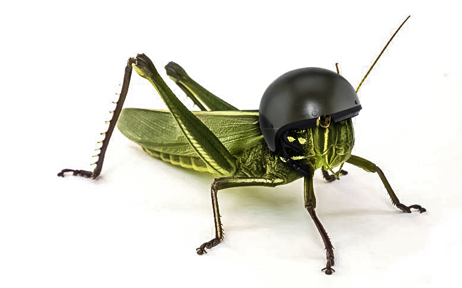

# KuznyechikDPA
Sources for DPA and CPA analysis of the GOST R 34.12-2015 aka "Kuznyechik" aka Grasshopper symmetric block cipher
Results presented at <a href="https://ruscrypto.ru">Ruscrypto 2019</a>

